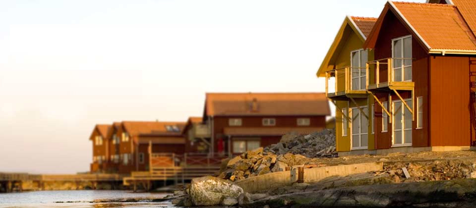
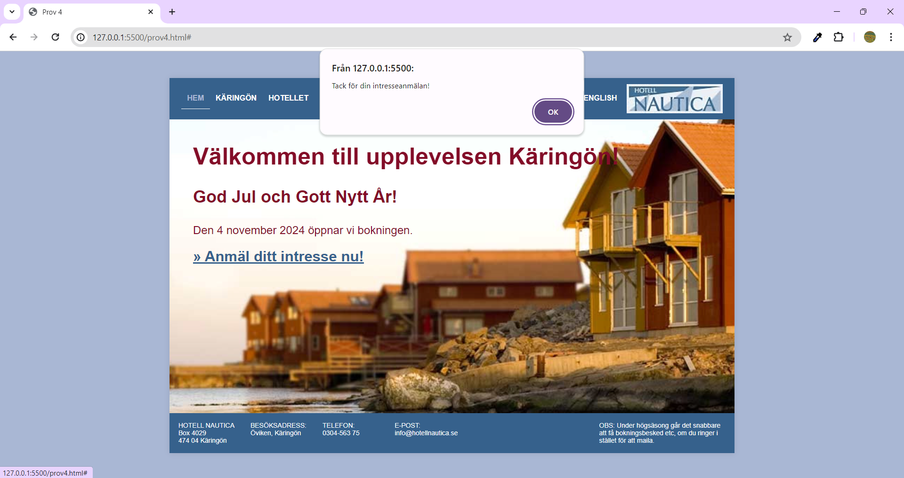

# Prov 4

## Instruktioner
* Designen är 960px bred.
* Placera designen ”centrerat” på sidan.
* Skapa en ”menyn” med rollover-effekt (understruken) och vald-effekt (ljusblå) som på bilden.
* Identifiera och välj rätt typsnitt.
* Skapa också en ”tack-ruta” som visas när man klickar på ”Anmäl ditt intresse nu!”

## Dokumentation
Du får titta på följande sidor:
* [HTML](https://www.w3schools.com/html/html_layout.asp)
* [CSS](https://www.w3schools.com/css/default.asp)
* [Javascript](https://www.w3schools.com/js/default.asp)

## Kvalité
* Kommentera din kod.
* Indentera din kod så den är tydlig att följa.

## Text som används
> Hem Käringön Hotellet Lägenheterna Aktiviteterna Bokning Erbjudanden English

> Välkommen till upplevelsen Käringön!\
> God Jul och Gott Nytt År!\
> Den 4 februari 2008 öppnar vi bokningen igen.\
> Anmäl ditt intresse nu!

> HOTELL NAUTICA Box 4029 474 04 Käringön\
> BESÖKSADRESS: Öviken, Käringön\
> TELEFON: 0304-563 75\
> E-POST: info@hotellnautica.se\
> OBS: Under högsäsong går det snabbare att få bokningsbesked etc, om du ringer i stället för att maila.

## Färger som används

* <code style="background:#830D28; color:#fff">#830D28</code>
* <code style="background:#A9B7D4; color:#000">#A9B7D4</code>
* <code style="background:#36618C; color:#fff">#36618C</code>
* <code style="background:#000; color:#fff">#000000</code>
* <code style="background:#888; color:#fff">#888888</code>

## Bilder som används

### Logga

### Bakgrundsbild

## Skärmdumpar

### Normal

### Klick

