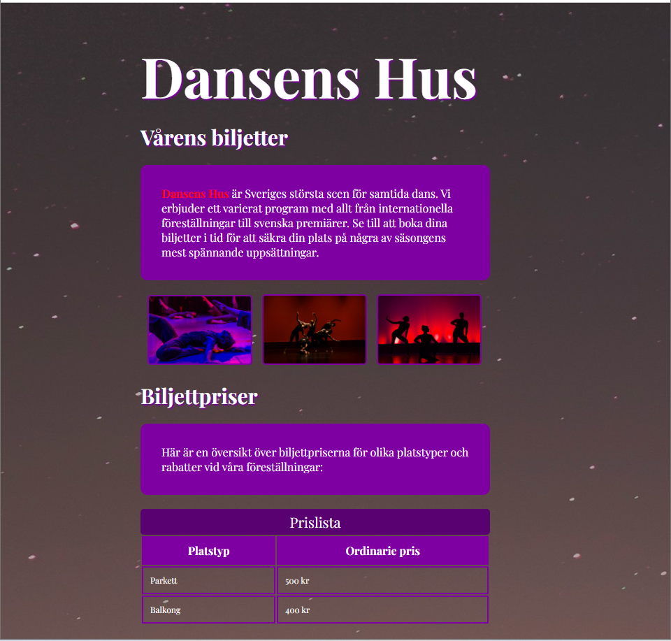

# Prov 1c

## Inspelning av hela provet krävs för godkänt prov
1. Starta inspelningen i **OBS Studio**
1. Arbeta med uppgiften
1. När du är klar **commit & sync**
1. Stoppa inspelningen i **OBS Studio** och lämna in videon på **Classroom**

## Provet



### Uppgift
- Skapa en sida som ser ut som skärmdumpen ovan.
- Sidan skall vara **500px bred** och **200px från vänsterkanten**.
- Importera typsnittet **"Playfair Display"** från Google Fonts: 
```css
@import url('https://fonts.googleapis.com/css2?family=Playfair+Display:ital,wght@0,400..900;1,400..900&display=swap');
```
- Använd typsnittet **"Playfair Display"**:
```css
font-family: "Playfair Display", serif;
```
- Länka **"Dansens Hus"** till den riktiga webbplatsen: https://dansenshus.se
- Infoga en tabell enligt skärmdumpen.

### Kvalité
* Kommentera din kod.
* Indentera din kod så den är tydlig att följa.

### Dokumentation
Du får titta på följande sidor:
* [HTML](https://www.w3schools.com/html)
* [CSS](https://www.w3schools.com/css/default.asp)
* [Javascript](https://www.w3schools.com/js/default.asp)

## Material som används

### Text som används
> "Dansens Hus är Sveriges största scen för samtida dans. Vi erbjuder ett varierat program med allt från internationella föreställningar till svenska premiärer. Se till att boka dina biljetter i tid för att säkra din plats på några av säsongens mest spännande uppsättningar."

> "Här är en översikt över biljettpriserna för olika platstyper och rabatter vid våra föreställningar:"

### Färger som används

* <code style="background:#7e00a2; color:#fff">#7e00a2</code>
* <code style="background:#590171; color:#fff">#590171</code>
