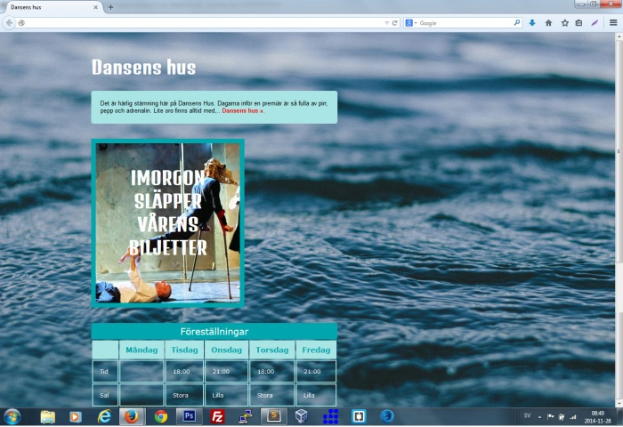

# Prov 1c

## Instruktioner
- Skapa en sida som ser ut som skärmdumpen nedan.
- Sidan har ett avstånd på 50px till toppkanten och 200px till vänsterkanten.
- Använd https://fonts.google.com/specimen/Denk+One?query=Den+one för rubrikerna "Dansens hus" och "Imorgon släpper vårens biljetter".
- Formatera all övrig text till "Verdana".
- Bilden på dansarna ska ha en blå ram.
- Länka "Dansens hus" till den riktiga webbplatsen enligt skärmdumpen.
- Infoga en tabell enligt skärmdumpen.
- Kommentera all din kod.
- Indentera din kod så att den är tydlig att följa.

## Dokumentation
Du får titta på följande sidor:
* [HTML](https://www.w3schools.com/html/html_layout.asp)
* [CSS](https://www.w3schools.com/css/default.asp)
* [Javascript](https://www.w3schools.com/js/default.asp)

## Kvalité
* Kommentera din kod.
* Indentera din kod så den är tydlig att följa.

## Text som används
> "Det är härlig stämning här på Dansens Hus. Dagarna inför en premiär är så fulla av pirr, pepp och adrenalin. Lite oro finns alltid med,... Dansens hus."

## Färger som används
- #38f7ff
- #00a6ad

## Bilder som används
Ladda ned alla bilder: [zip-fil](bilder/prov1c_bilder.zip)

## Skärmdumpar

