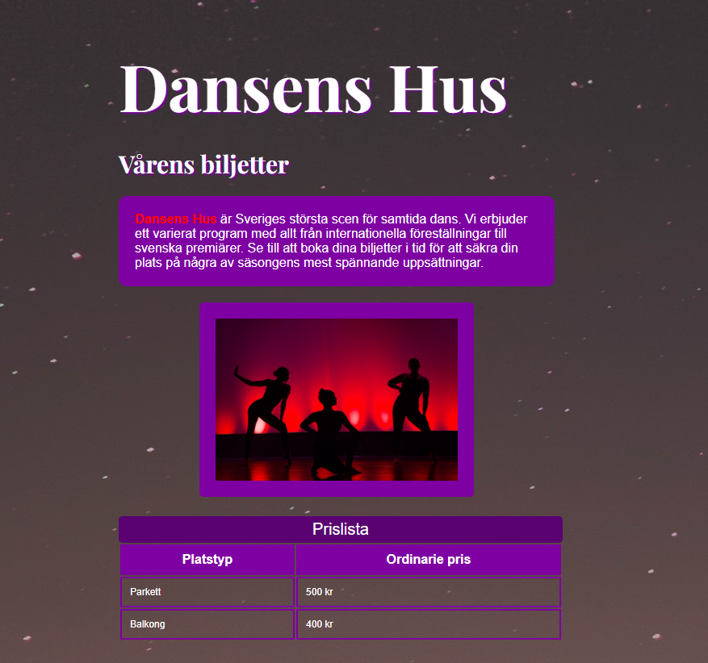

# Prov 1c: Dansens hus – vårens biljetter

## Inspelning av hela provet krävs för godkänt prov
1. Starta inspelningen i **OBS Studio**
1. Arbeta med uppgiften
1. När du är klar, kör **commit & sync**
1. Stoppa inspelningen i **OBS Studio** och lämna in videon på **Classroom**

## Instruktioner för provet
* Skapa en webbsida för Dansens Hus med information om vårens biljetter.
* Textstyckena skall vara **500px breda**, och sidan placerad **150px från vänsterkanten**.
* Länka "Dansens Hus" till den riktiga webbplatsen: https://dansenshus.se
* Infoga en tabell enligt skärmdumpen.
* Indentera din kod så att den är tydlig att följa.

## Text som ska användas
> **Dansens Hus**
>
> **Vårens biljetter**
>
> Dansens Hus är Sveriges största scen för samtida dans. Vi erbjuder ett varierat program med allt från klassisk balett till modern dans. Välkommen att uppleva rörelse och magi!
>
> **Bildgalleri**
> (En dansbild)
>
> **Biljettpriser**
>
> | Platstyp | Ordinarie pris |
> |---|---|
> | Parkett | 500 kr |
> | Första raden | 400 kr |
> | Andra raden | 300 kr |
> | Tredje raden | 200 kr |
> | Ståplats | 100 kr |

## Typsnitt som ska användas

* Formatera rubrikerna till "Playfair Display"
* Formatera all övrig text till "Arial". 

Importera och använd följande typsnitt från Google Fonts:
`@import url('https://fonts.googleapis.com/css2?family=Playfair+Display:ital,wght@0,400..900;1,400..900&display=swap');`

Använd såhär: `font-family: "Playfair Display";`

## Färger som ska användas
* <code style="background:#7e00a2; color:#fff">#7e00a2</code> (lila)
* <code style="background:#590171; color:#fff">#590171</code> (mörklila)

## Hjälp på provet

Du får titta på följande sidor:
* [HTML](https://www.w3schools.com/html)
* [CSS](https://www.w3schools.com/css/default.asp)
